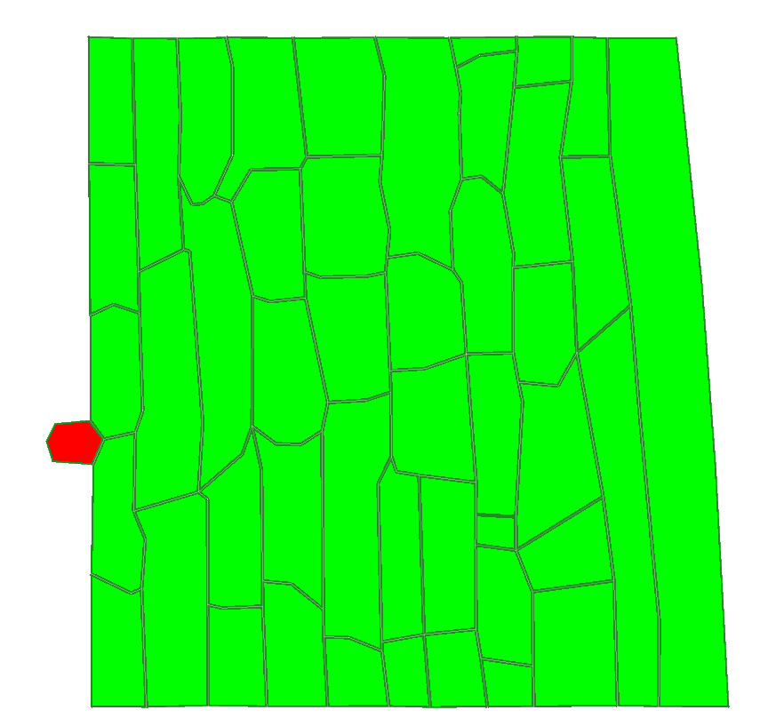
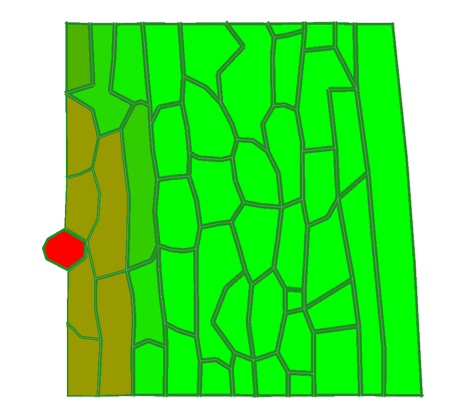
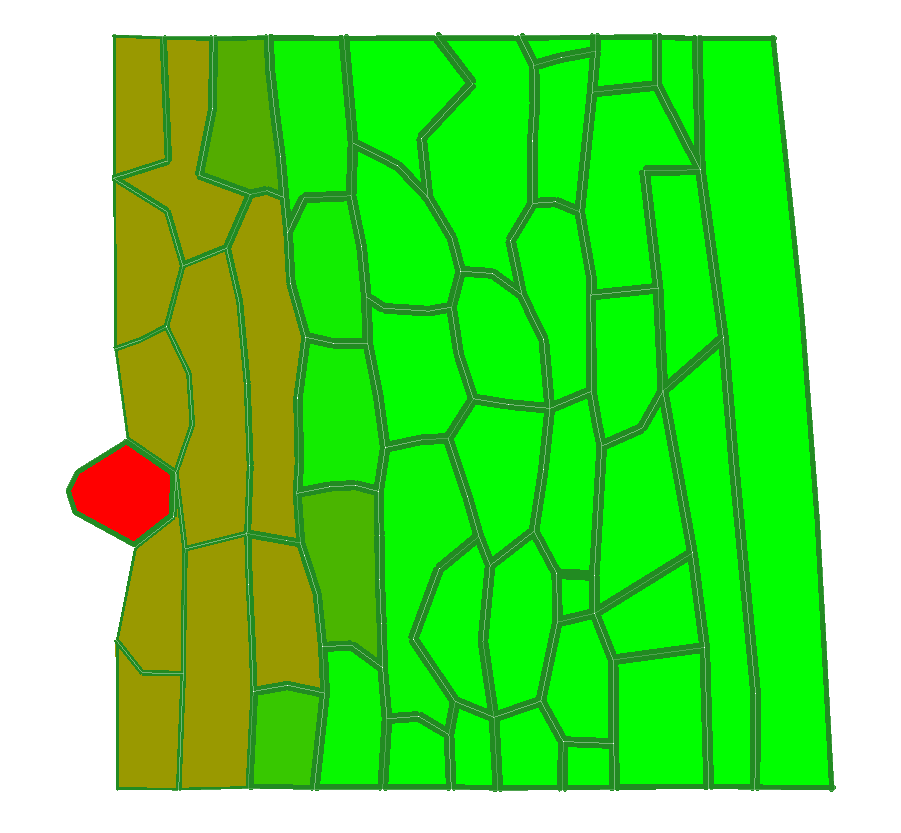
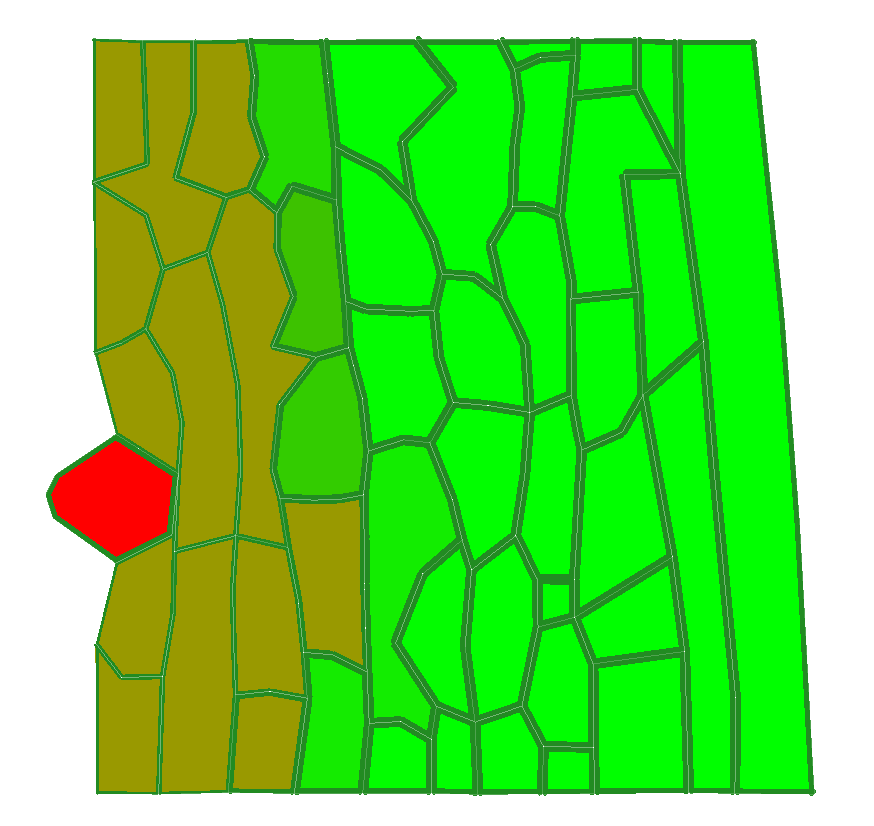
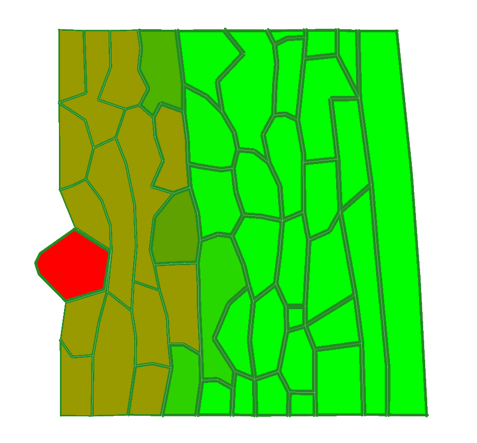

# Assignment 4: VirtualLeaf - Pathogen Infection Model

**Course**: KEN3170 - Biological Systems Modeling  
**Topic**: Plant-Pathogen Interaction Simulation  
**Platform**: VirtualLeaf

## Model Overview

This assignment focuses on modeling **pathogen infection dynamics** in plant tissues using VirtualLeaf. The simulation involves:

- **Pathogen (Red)**: Infectious agent that spreads through plant tissue
- **Plant Tissue (Green)**: Host cells that can be infected
- **Chemical Secretion**: Pathogen releases cell wall weakening agents
- **Cell Wall Dynamics**: Chemical reduces cell wall stability, facilitating infection spread

---

## Assignment Tasks

### 1. Initial Simulation & Observation
**Objective**: Run the baseline model and document the infection dynamics

**Instructions**:
- [ ] Open the VirtualLeaf pathogen infection model
- [ ] Run the simulation for **4 hours** (as-is, no modifications)
- [ ] Document observations with screenshots at:
    - [ ] **t = 0h** (Initial time point)
        
        
        
    - [ ] **t = 1h** 
        
        
        
    - [ ] **t = 2h**
        
        
        
    - [ ] **t = 3h**
        
        
        
    - [ ] **t = 4h** (Final time point)
        
        

**Guiding Questions**:
- What is happening during the simulation?
The auxin concentration of the cells next to the pathogen is lowering, and the pathogen is increasing in size. This is because the chemical the pathogen secretes is reducing cell wall stiffness of the surrounding cells, therefore allowing it to grow and expand further into compromised areas.
- How does the pathogen spread?
It increases in size, almost adopting a circle-like shape. It does this by secreting chemicals that weaken neighbouring cell walls, reducing the wall tension, giving the pathogen more space to grow without pushback from neighbouring cells. The weakening of the cell walls also makes diffusion easier, allowing the chemical to spread easily to new cells.
- What changes do you observe in the plant tissue?
It goes brown instead of green, meaninig that auxin saturation lowers since it gets mixed with the pathogen chemical, and the wall structure gets altered since it's stiffness decreases. It looks like the pathogen is pushing into the plant cells.
- How does the infection pattern evolve over time?
The pathogen increases in size by weakining the cells walls of neighbouring cells and alters their shape by pushing into them. The infection then spreads towards more adjacent cells and the cycle continues.
---

### 2. Code Analysis: CellHouseKeeping Section
**Objective**: Understand the computational implementation of cellular processes

**Instructions**:
- [ ] Examine the VirtualLeaf code and focus on the **CellHouseKeeping** section

```cpp
void Assignment::CellHouseKeeping(CellBase *c) {
    // add cell behavioral rules here
    if(c->CellType()==2){
        c->EnlargeTargetArea(2);
    }

    // initial cell length setup
    double base_element_length = 25;
    c->LoopWallElements([base_element_length](auto wallElementInfo){
        if(std::isnan(wallElementInfo->getWallElement()->getBaseLength())){
        wallElementInfo->getWallElement()->setBaseLength(base_element_length);
        }
    });


    //cell wall weakening happens here
    double patho_chem_level = c->Chemical(0) / (0.5);
    if (patho_chem_level > 1.2) {
        patho_chem_level = 1.2;
    }
    double stiffness_inf = 2.5;
    if(patho_chem_level>0.1 && c->CellType()!=2){
        c->SetCellVeto(false);
        stiffness_inf = 2.5 - (patho_chem_level);
    c->LoopWallElements([stiffness_inf](auto wallElementInfo){
        wallElementInfo->getWallElement()->setStiffness(stiffness_inf);
    });
    }
    else{
        c->LoopWallElements([stiffness_inf](auto wallElementInfo){
        wallElementInfo->getWallElement()->setStiffness(stiffness_inf);
        });
        c->SetCellVeto(true);
    }
}
```


- [ ] Write a detailed description of what this code section does

The cellHouseKeeping function simulates the 'housekeeping' functions for a cell. It has 3 main functions.

1) Cell behavior rules:
   For cell type 2 there is a specific rule added, which states that the traget area should be increased by 2, simulating fast growth. Cell type 2 refers to the pathogen, for the normal cells this rule is therfore not applied.

2) Initial cell length setup:
   The function sets the wall lenght to 25, if the wall length is undefinded. It does this for each wall element of a cell, to ensure that all elements are initialed properly.

3) Cell wall weakening:
   The function first reads the concentration of the pathogen chemical in the cell. It is capped at a concentration of 1.2, probably to prevents exesive effects of the pahtogen.
   
   When the pathogen chemical levels surpasses 0.1 and the cell is not a pathogen (cell type 2), the wall stifness of the cell decreases (2.5 - chemical_level), weakening all the cell walls of the cell AND the function removes cell division restrictions (SetCellVeto(false))

   For unnafected cells or if the cell is a pathogen (cell type 2), wall stiffness remains at 2.5 for all cell walls and the cell is restricted because of SetCellVeto(true).
  

---

### 3. Network Analysis & Completion
**Objective**: Compare code implementation with conceptual network diagram

**Instructions**:
- [ ] Examine the **cell-to-cell transport** code section
- [ ] Examine the **cell dynamics** code section  
- [ ] Compare the equations in the code to the provided network sketch
- [ ] Identify missing information in the sketch
- [ ] Complete the network diagram

**Deliverables**:
- [ ] Updated network sketch (complete diagram)
- [ ] Documentation of missing elements identified
- [ ] Comparison between code equations and network representation

**Reference Image**: 


---

### 4. Parameter Sensitivity Analysis
**Objective**: Investigate the effect of diffusion coefficient on infection dynamics

**Instructions**:
- [ ] **Experiment A**: Decrease pathogen chemical diffusion coefficient by **factor of 10**
  - Run simulation for 4h
  - Document with screenshots (t = 0, 1, 2, 3, 4h)
  - Record observations
  
- [ ] **Experiment B**: Increase pathogen chemical diffusion coefficient by **factor of 10** 
  - Run simulation for 4h  
  - Document with screenshots (t = 0, 1, 2, 3, 4h)
  - Record observations

**Analysis**:
- [ ] Compare results to baseline simulation
- [ ] Describe changes in infection patterns
- [ ] Explain biological significance of diffusion coefficient changes

---

### 5. Plant Defense Mechanism Design
**Objective**: Design a computational model for plant immune response

**Scenario**: 
> The plant has evolved a defense mechanism that:
> - Detects the pathogen's chemical signal
> - Triggers strengthening of cell walls in uninfected plant cells
> - Provides resistance against pathogen invasion

**Instructions**:
- [ ] Design the implementation strategy (conceptual level)
- [ ] Write pseudocode for different model sections
- [ ] **Note**: No actual C++ code required - pseudocode is sufficient

**Deliverables**:
```markdown
## Plant Defense Mechanism Implementation

### Detection System
[Pseudocode for chemical detection]

### Signal Transduction  
[Pseudocode for defense signal propagation]

### Cell Wall Strengthening
[Pseudocode for wall reinforcement mechanism]

### Integration with Existing Model
[How to incorporate into current VirtualLeaf framework]
```

